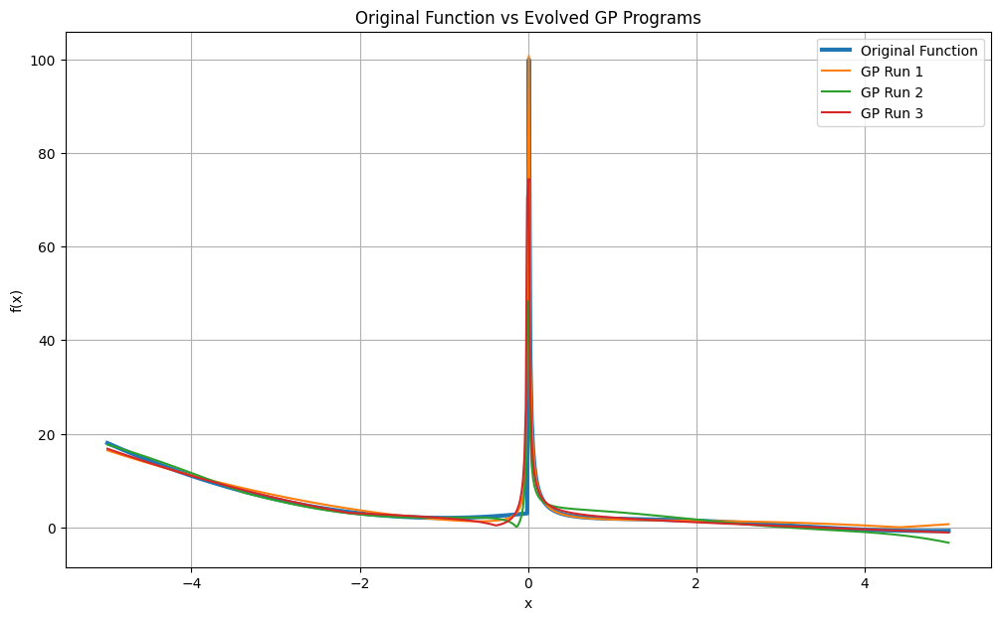
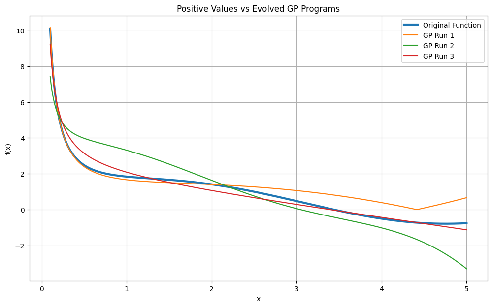
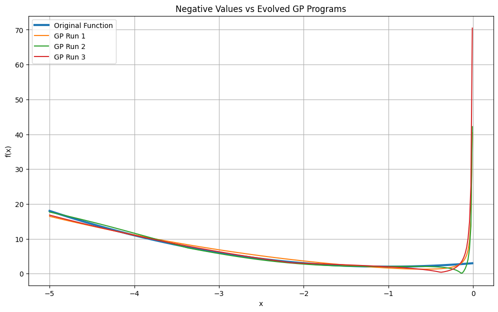

# Genetic Programming Application

This project contains two Jupyter notebooks demonstrating genetic programming and evolutionary algorithms:

1. Symbolic regression with genetic programming.
2. Multi-objective feature selection with NSGA-II for classification.

## Project Files

### `symbolic_regression_gp.ipynb`

Uses DEAP genetic programming to evolve mathematical expressions that approximate a target function:

```text
f(x) = 1/x + sin(x), when x > 0
f(x) = 2x + x^2 + 3, otherwise
```

The notebook:

- Generates training points between `-5` and `5`.
- Builds expression trees using arithmetic operators, trigonometric functions, absolute value, and random constants.
- Evaluates expressions using mean squared error.
- Handles invalid numerical results with protected division and invalid-fitness penalties.
- Runs the genetic algorithm multiple times.
- Plots the evolved expressions against the original target function.

#### Symbolic Regression Results

The notebook produces the following comparisons between the target function and three evolved GP programs:







### `non_dominated_sorting_ga.ipynb`

Uses a multi-objective genetic algorithm based on NSGA-II to select useful feature subsets for a decision-tree classifier.

Each individual is a binary chromosome representing whether each dataset feature is selected. The two objectives are:

- Minimize classification error.
- Minimize the proportion of selected features.

The notebook uses DEAP for the evolutionary algorithm and scikit-learn for encoding, train/test splitting, decision-tree classification, and accuracy measurement. It also plots the resulting Pareto-front objective values and compares selected-feature performance with the full dataset.

The notebook loads the Musk `Clean1` dataset by default. A commented code block can be enabled to use the Vehicle dataset instead.

## Datasets

### `dataset/question_4/musk/`

- `clean1.data`: Feature data and class labels for the Musk `Clean1` dataset.
- `clean1.names`: Column names and feature descriptions used by the notebook when loading the data.
- `clean1.info`: Background information about the dataset. It contains 476 conformations representing 92 molecules and 166 continuous features plus identifying fields and a class label.

The notebook label-encodes the molecule and conformation names before running feature selection and classification.

### `dataset/question_4/vehicle/`

- `vehicle.dat`: Vehicle silhouette measurements and class labels.
- `vehicle.doc`: Dataset documentation. The dataset is a four-class vehicle-silhouette classification problem with 18 features.

## Requirements

Python 3 and Jupyter are required. The notebooks use these Python packages:

- `deap`
- `numpy`
- `pandas`
- `scikit-learn`
- `matplotlib`

Install them with:

```bash
python -m pip install deap numpy pandas scikit-learn matplotlib jupyter
```

## Running the Notebooks

From the repository root, start Jupyter:

```bash
jupyter notebook
```

Open either notebook and run its cells from top to bottom. Run from the repository root so the relative dataset paths in `non_dominated_sorting_ga.ipynb` resolve correctly.

